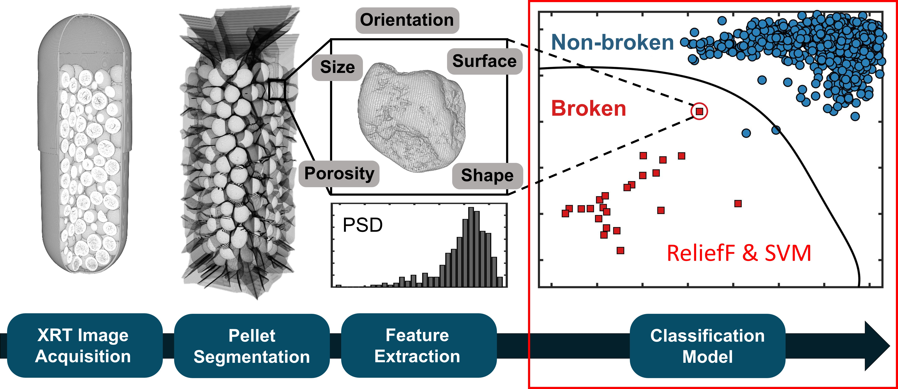

# SVM_MinWorkEx_MATLAB

<!-- Graphical Abstract -->
 

  

<!-- About The Project -->
## About The Project

This repository was created for anybody interested in using feature selection (ReliefF, Matlab: relieff) and support vector machines (SVM, Matlab: fitcsvm) as a minimum working example to reproduce steps described in the publication below (Doerr2020). Data is provided in the sub-folder '_Data'. Structural features were extracted from micro-X-ray tomography data. ReliefF and SVM were used to build a classifier for the detection of broken pharmaceutical pellets within the sample.

Code written by Frederik Doerr (@frederik-d), Feb 2020 (MATLAB R2019b)  
Application: For 'Support Vector Machine - Introduction and Application'  
Contact: frederik.doerr(at)strath.ac.uk / CMAC ([http://www.cmac.ac.uk/](http://www.cmac.ac.uk/))  

<!-- Reference-->
## Reference (open access):
Doerr, F. J. S., Florence, A. J. (2020). *A micro-XRT image analysis and machine learning methodology for the characterisation of multi-particulate capsule formulations.* International Journal of Pharmaceutics: X. [https://doi.org/10.1016/j.ijpx.2020.100041](https://doi.org/10.1016/j.ijpx.2020.100041)

Data repository: [https://doi.org/10.15129/e5d22969-77d4-46a8-83b8-818b50d8ff45](https://doi.org/10.15129/e5d22969-77d4-46a8-83b8-818b50d8ff45)  
Video Abstract: [https://strathprints.strath.ac.uk/id/eprint/71463](https://strathprints.strath.ac.uk/id/eprint/71463)  
Slide Deck: [https://doi.org/10.13140/RG.2.2.26289.20322](https://doi.org/10.13140/RG.2.2.26289.20322)  

<!-- Data -->
## Input Data:
(1) Extracted features of six ibuprofen (IBU) capsules (1763 pellets, 206 features):
* 'Desc_DataFile_C0.csv'
* 'Desc_DataFile_C1.csv'
* 'Desc_DataFile_C2.csv'
* 'Desc_DataFile_C3.csv'
* 'Desc_DataFile_C4.csv'
* 'Desc_DataFile_C5.csv'

(2) User defined feature categories:
* 'Feature_Categories.csv'

(3) Results of a feature sensitivity analysis:
* 'Feature_SenAnlys_Score.csv'
